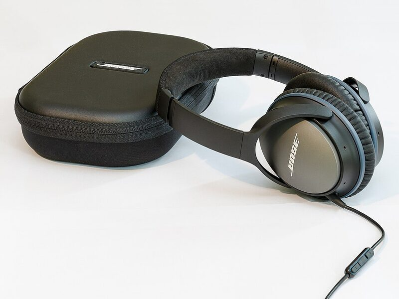
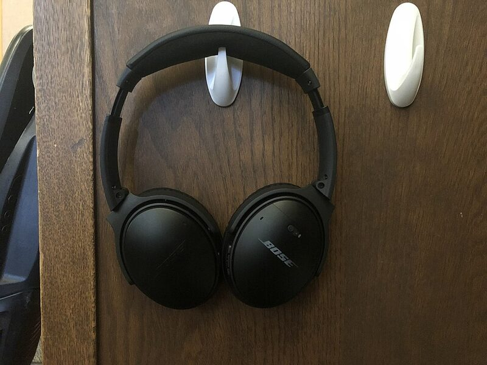

# Lesson 04 Walkthrough: Building a Product Showcase Page

## Overview

In this guided walkthrough, you will build a **Product Showcase page** that includes:
- An image gallery with alt text and captions
- An embedded product video
- A comparison table of product features

**Time:** 30-35 minutes total, split across three days

> **INSTRUCTOR NOTE - this walkthrough is a live demo, done in three pieces.**
> Build Parts 1 and 2 on Tuesday, Part 3 on Wednesday, Part 4 on Thursday.
> There is a **STOP** line at the end of each piece. When you reach it, stop the demo and have students do that day's task. Do not keep going into the next part.

---

## Before you start: get the images

The pictures for this lesson are in the **`images`** folder inside `html04_imagesMediaTables` on GitHub:
https://github.com/42mcmaster/htmlCssJavaScript/tree/main/html04_imagesMediaTables/images

Download them and put them in a folder named **`images`** right next to your task file, like this:

```
html04/
  html04a_Task.html
  images/
    nature-scene-1.jpg
    nature-scene-2.jpg
    ...
```

The `` tags use paths like `images/nature-scene-1.jpg`. If the folder isn't there, or is named something else, the image shows as a broken icon. That's not a bug in your code — it's the path.

---

## Part 1: Setting Up the HTML Structure

Start with a basic HTML5 document. Let's call the doc `html04Walkthrough.html`.  Fill in the missing parts (marked with `___`):

```html
<!DOCTYPE html>
<html lang="en">
<head>
  <meta charset="UTF-8">
  <meta name="viewport" content="width=device-width, initial-scale=1.0">
  <title>___</title>
  <!-- The block below is CSS. It only draws borders on tables so you can
       see rows and cells. CSS is Lesson 05 - leave this alone for now. -->
       <!-- border: adds a 1px solid dark line around the table and cells -->
  <!-- border-collapse: merges double cell borders into a single clean line -->
  <!-- padding: adds 6px of inner space between cell borders and text -->
  <style>
    table, th, td { border: 1px solid #f83737; border-collapse: collapse; }
    th, td { padding: 6px; }
  </style>
</head>
<body>

  <header>
    <h1>___</h1>
    <p>Explore our premium product lineup</p>
  </header>

  <!-- You'll add image gallery here -->

  <!-- You'll add video here -->

  <!-- You'll add comparison table here -->

</body>
</html>
```

**FILL IN THE BLANKS:**
- Title tag: `Premium Headphones`
- Header h1: `Premium Headphones`

---

## Part 2: Adding an Image Gallery with Captions

Add this section inside the `<body>` (after `<header>`):

```html
<section id="gallery">
  <h2>Product Gallery</h2>

  <figure>
    
    <figcaption>Front view of the wireless headphones</figcaption>
  </figure>

  <figure>
    
    <figcaption>Headphones next to the carrying case</figcaption>
  </figure>

  <figure>
    
    <figcaption>Headphones hanging on a wall hook</figcaption>
  </figure>
</section>
```

**FILL IN THE BLANKS:**
- Alt text for image 1: `Black over-ear headphones, angled front view`
- Alt text for image 2: `Black headphones beside a zippered carrying case`
- Alt text for image 3: `Black headphones hanging on a white wall hook`

**Key concepts:**
- Use descriptive `alt` text for accessibility (screen readers, image fails to load)
- `<figure>` + `<figcaption>` keeps images and captions semantically related
- The photos come from the unit `images/` folder (free Creative Commons photos - see `images/CREDITS.md`)

---

> ## STOP - End of Tuesday's demo
> Students now do **`html04a_Task.html`** (images), then work on `html04_Project.md` (gallery; start the promo script).
> Pick the demo back up at Part 3 on Wednesday.

---

## Part 3: Embedding a Product Video

Add this section (after the gallery section):

```html
<section id="video">
  <h2>Watch the Product Demo</h2>

  <!-- Embedded YouTube video -->
  <iframe width="560" height="315"
    src="https://www.youtube.com/embed/___"
    title="Product Demo Video"
    allowfullscreen>
  </iframe>
</section>
```

**FILL IN THE BLANK:**
- YouTube video ID: `m5V5jP1VCzo` (Bose Quiet Comfort Headphones)

**Key concepts:**
- `<iframe>` embeds external content (like YouTube)
- Use the **embed URL** (ends with `/embed/VIDEO_ID`), not the share URL.  Let's go to YouTube and find the `EMBED` link (start with `Share`)
- `allowfullscreen` attribute lets users expand to full screen
- `title` improves accessibility

---

> ## STOP - End of Wednesday's demo
> Students now do **`html04b_Task.html`** (media), then work on `html04_Project.md` (record and shoot the promo).
> Pick the demo back up at Part 4 on Thursday.

---

## Part 4: Creating a Feature Comparison Table

Add this section (after the video section):

```html
<section id="comparison">
  <h2>Product Comparison</h2>

  <table>
    <caption>Bose Quiet Comfort Headphone Models Comparison</caption>
    <tr>
      <th>Feature</th>
      <th>___</th>
      <th>Premium Plus</th>
      <th>Professional</th>
    </tr>
    <tr>
      <td>Battery Life</td>
      <td>20 hours</td>
      <td>30 hours</td>
      <td>___</td>
    </tr>
    <tr>
      <td>Noise Cancellation</td>
      <td>Passive</td>
      <td>___</td>
      <td>Active (Adjustable)</td>
    </tr>
    <tr>
      <td>Bluetooth Range</td>
      <td>10m</td>
      <td>15m</td>
      <td>___</td>
    </tr>
    <tr>
      <td>Price</td>
      <td>$99.99</td>
      <td>$149.99</td>
      <td>___</td>
    </tr>
  </table>
</section>
```

**FILL IN THE BLANKS:**
- Column 2 header (th): `Basic Model`
- Battery Life for Professional: `40 hours`
- Noise Cancellation for Premium Plus: `Active (Preset Modes)`
- Bluetooth Range for Professional: `20m`
- Price for Professional: `$249.99`

**Key concepts:**
- `<table>` organizes data into rows and columns
- `<th>` = header cells (bold, centered); `<td>` = data cells
- `<caption>` provides table title for accessibility
- Tables make complex comparisons easy to read

---

## CHALLENGE: Add colspan/rowspan

`colspan` makes one cell stretch across more than one column. Right now the table has 4 columns: Feature, Basic Model, Premium Plus, Professional. Add a new first row with one big "Product Models" header that stretches across the whole table.

Add this row **above** the existing header row (right after the `<caption>`):

```html
<tr>
  <th colspan="___">Product Models</th>
</tr>
```

**FILL IN THE BLANK:**
- colspan value: `4` (one cell stretched across all four columns)

**What you should see:** a new top row where "Product Models" is one wide cell running the full width of the table.

**Why the row has 1 cell, not 4:** every row has to add up to 4 columns. A normal row does that with 4 cells. This row does it with a single cell that counts as 4.

**Try it:** change the value to `3` and look at the table again. The row only adds up to 3, so the browser leaves a gap on the right. Change it back to `4`. Then run the page through the W3C validator (Part 5) with the value set to `5`. The validator reports an extra column that has no cells in it. That's how you catch a colspan that's too big, since the browser won't show you the mistake.

---

> ## STOP - End of Thursday's demo
> Students now do **`html04c_Task.html`** (tables), then work on `html04_Project.md` (comparison table; finish the promo in Canva).
> Part 5 (testing and validation) is Friday, after the Unit 1 quiz, when students finish and push their site.

---

## Part 5: Testing & Validation

1. Save your file as `product-showcase.html`
2. Open it in a browser—verify:
   - All images load with proper alt text (use developer tools)
   - Video embeds and has controls
   - Table displays correctly with aligned columns
3. Use the W3C HTML Validator: https://validator.w3.org/

---

## Summary

You've built a product showcase page with:
- ✓ Semantic image structure using `<figure>` and `<figcaption>`
- ✓ Descriptive alt text for accessibility
- ✓ Embedded external video via `<iframe>`
- ✓ Data-driven table with proper headers

**Next:** Move to the individual tasks (04a, 04b, 04c) to practice each skill independently!

